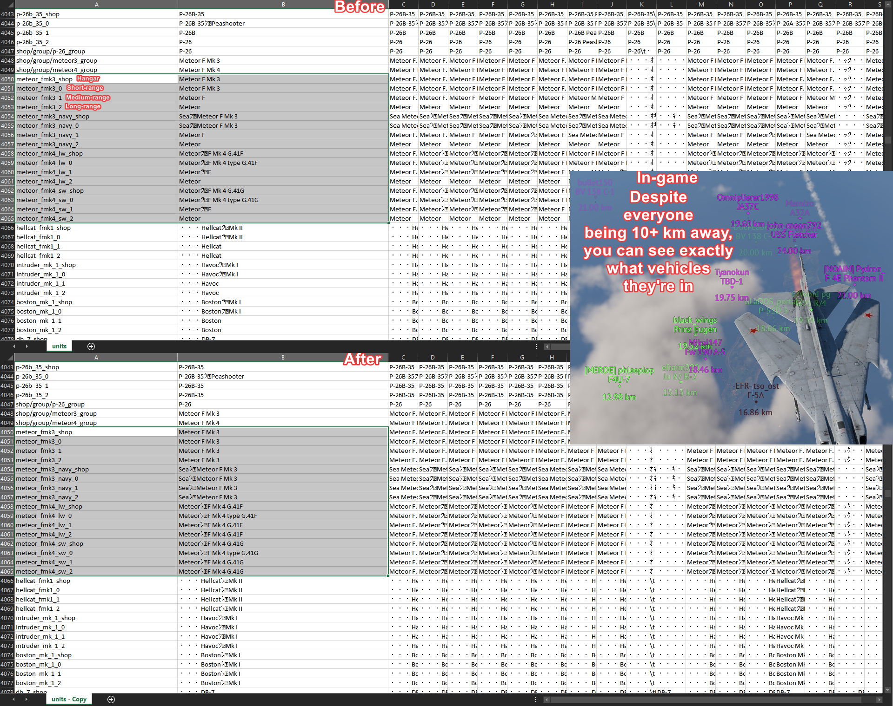

# WTFullUnitNameConverter

Covnverts ambigious vehicle names at distances greater than 1 km to their "shop" names, which are used when viewing tech trees.

# Showcase



# Readme.txt

0. Requirements: .NET Framework 4.8 (probably)
1. Compile a test localization by adding the testLocalization:b=yes line to the debug section of the config.blk file located in the game's main directory and launching and closing the game once, i.e.

```
debug{
  screenshotAsJpeg:b=yes
  512mboughttobeenoughforanybody:b=yes
  enableNvHighlights:t="off"
  testLocalization:b=yes
  enableFMCommands:b=yes
}
```
2. Launch the provided .exe file normally and point it to the units.csv (or IFN1_01_units.csv if you're using the IFN1 Vehicle Re-Name Mod) file in the newly created lang folder located in the game's main directory, press the Convert File button
3. Alternatively launch the file from the Command Prompt to use available arguments:
	1) First argument: full path to the units.csv file (i.e. "G:\SteamLibrary\steamapps\common\War Thunder\lang\units.csv" with quotation marks)
	2) Second argument (optional): -silent (disables all popup windows, i.e. "G:\SteamLibrary\steamapps\common\War Thunder\lang\units.csv" -silent)
4. Alternatively, put the WTFullNameUnitConverter folder into the game's directory and launch the Patch.bat file (or Patch_IFN1.bat if you're using the IFN1 Vehicle Re-Name Mod)
5. Remember to recompile the test localization (i.e. delete the entire lang folder and repeat steps 1 and 2) every time language files get changed in any way to avoid having raw internal lines (i.e. ussr_pt_76_57 and the like) appear in the game
